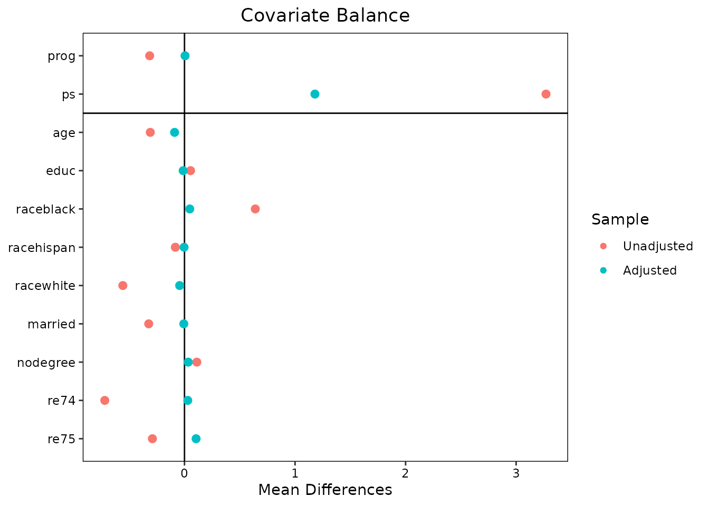
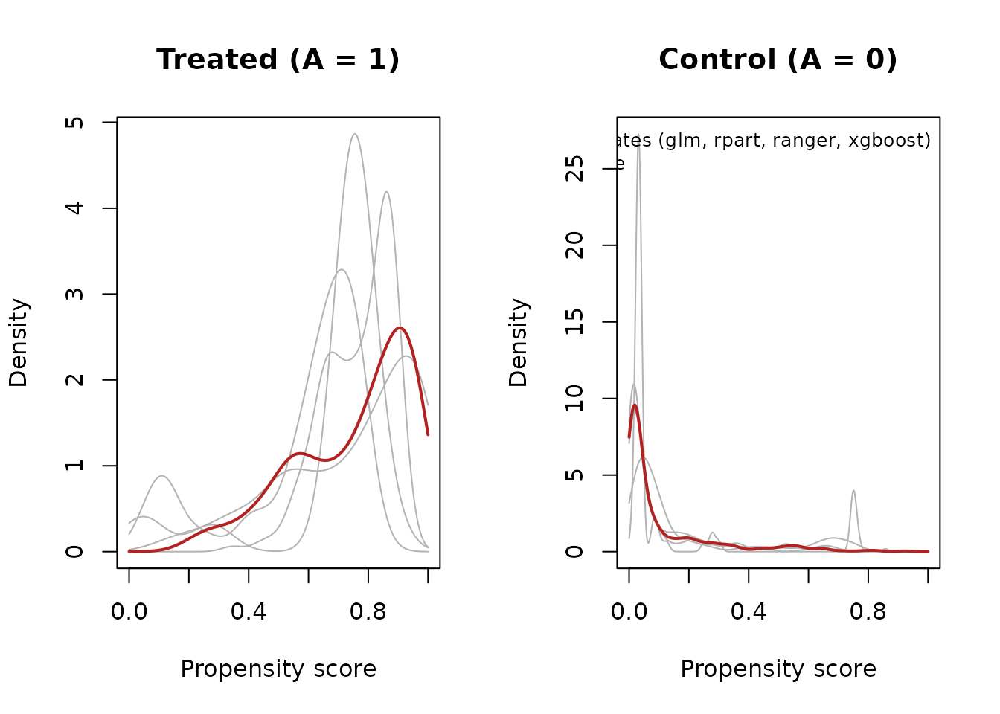
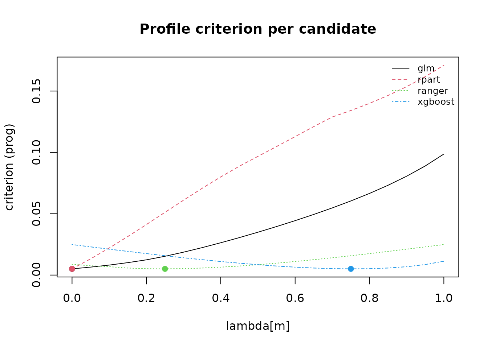

# Getting Started with psAve

## Introduction

Propensity score (PS) analyses are only as good as the propensity score
model, and in practice the analyst rarely knows which model is right.
Logistic regression may miss nonlinearities and interactions; flexible
machine learning methods (classification trees, random forests, gradient
boosting) capture them but can produce extreme scores and unstable
weights. Different candidate models often yield propensity scores that
all “look reasonable” yet lead to materially different effect estimates
— a form of model dependence that undermines the credibility of the
analysis. Rather than committing to a single model, `psAve` constructs a
*model-averaged* propensity score: a convex combination
$`\bar e(X) = \sum_m \lambda_m \hat e_m(X)`$ of candidate propensity
scores, with the mixing weights $`\lambda`$ chosen on a simplex grid to
optimize a balance criterion, implementing the method of Kabata, Stuart
& Shintani (2024).

The distinguishing feature of the method is *what* the mixing weights
are asked to balance. Covariate balance criteria treat all covariates as
equally important, but for bias in the treatment effect what matters is
balance on covariates *as they relate to the outcome*. The prognostic
score — the predicted outcome under the untreated condition,
$`g(0, X)`$, estimated from untreated units only (Hansen 2008) —
summarizes exactly that relationship, and prognostic-score balance has
been shown to be a useful diagnostic for propensity score methods
(Stuart, Lee & Leacy 2013). `psAve` takes this one step further and uses
the weighted standardized mean difference of a (model-averaged)
prognostic score as the *selection criterion* for the propensity score
mixing weights. In the simulations of Kabata, Stuart & Shintani (2024),
this “Prog (Ave)” strategy gave the lowest and most robust bias and RMSE
across 16 scenarios, compared with single-model propensity scores and
with model averaging targeted at prediction accuracy or covariate
balance. The result of
[`psave()`](https://kabajiro.github.io/psAve/reference/psave.md) is
deliberately modest: a numeric vector of propensity scores, designed to
be handed to
[`MatchIt::matchit()`](https://kosukeimai.github.io/MatchIt/reference/matchit.html)
as a distance measure or to
[`WeightIt::weightit()`](https://ngreifer.github.io/WeightIt/reference/weightit.html)
as a propensity score, with balance assessment via `cobalt`.

## Installation

`psAve` can be installed from GitHub:

``` r

# install.packages("remotes")
remotes::install_github("kabajiro/psAve")
```

The core of the package requires only `cobalt` (an Import). The
candidate learners beyond logistic regression (`rpart`, `ranger`,
`xgboost`), as well as `MatchIt` and `WeightIt` for the downstream
analysis, are Suggests and are only needed when you actually request
them.

## A matching workflow with the `lalonde` data

We illustrate the paper’s headline estimator — the model-averaged
propensity score selected by balance on the model-averaged prognostic
score, “Prog (Ave)” — on the `lalonde` dataset that ships with
`MatchIt`. The estimand is the average treatment effect in the treated
(ATT), the package default.

``` r

library(psAve)
data("lalonde", package = "MatchIt")
```

### Step 1: Estimate the model-averaged propensity score

[`psave()`](https://kabajiro.github.io/psAve/reference/psave.md) looks
deliberately like `matchit()` and `weightit()`: a treatment formula and
a data frame. The one addition is the `outcome` argument, which names
the outcome variable used to build the prognostic score. A one-sided
formula (`~ re78`) reuses the covariates on the right-hand side of
`formula` as the prognostic-model predictors; a two-sided formula
(`re78 ~ age + educ + ...`) lets you specify a distinct prognostic
model.

Two of the default candidate learners (`ranger` and `xgboost`) are
stochastic, so set a seed first for reproducibility:

``` r

set.seed(1234)
fit <- psave(treat ~ age + educ + race + married + nodegree + re74 + re75,
             data = lalonde, outcome = ~ re78)
```

By default this fits four candidate propensity score models (`"glm"`,
`"rpart"`, `"ranger"`, `"xgboost"`) and four candidate prognostic models
with the same learners, then searches all 1,771 points of the
mixing-weight simplex (step 0.05, four candidates). The whole call takes
on the order of seconds to a minute on the `lalonde` data (n = 614),
with `xgboost` dominating the runtime; for a quick first pass you can
restrict `ps.methods` (e.g., `ps.methods = c("glm", "rpart")`).

``` r

fit
#> A psave object (model-averaged propensity score)
#>  - estimand:  ATT
#>  - criterion: prog (weighted ASMD of the model-averaged prognostic score)
#>  - sample:    614 units (185 treated, 429 control)
#> 
#> lambda (PS mixing weights):
#>   glm      0.000  |                    |
#>   rpart    0.000  |                    |
#>   ranger   0.250  |=====               |
#>   xgboost  0.750  |===============     |
#> 
#> gamma (prognostic mixing weights):
#>   glm      0.000  |                    |
#>   rpart    0.000  |                    |
#>   ranger   0.000  |                    |
#>   xgboost  1.000  |====================|
#> 
#> Criterion value at selected lambda: 0.00506
#> 
#> Balance preview (worst covariates + prognostic score):
#>           smd.un smd.wt ks.un ks.wt
#> racewhite  1.882  0.147 0.558 0.044
#> raceblack  1.762  0.131 0.640 0.048
#> re75       0.290  0.105 0.288 0.121
#> prog       0.315  0.005 0.176 0.142
#> 
#> Next:
#>   MatchIt::matchit(treat ~ age + educ + race + married + nodegree + re74 + re75, data = lalonde, distance = x$ps)
#>     or: psave_match(x)
#>   WeightIt::weightit(treat ~ age + educ + race + married + nodegree + re74 + re75, data = lalonde, ps = x$ps, estimand = "ATT")
#>     or: psave_weight(x)
```

The printout shows the estimand and criterion, the selected mixing
weights $`\lambda`$ (for the propensity score candidates) and $`\gamma`$
(for the prognostic candidates), the achieved criterion value, a short
balance preview, and — importantly — the literal next call you would
issue to carry the score into `MatchIt`.

### Step 2: Match on the averaged propensity score

`fit$ps` is a plain numeric vector, named by the rownames of `data`, and
can be passed directly to
[`MatchIt::matchit()`](https://kosukeimai.github.io/MatchIt/reference/matchit.html)
as the `distance` argument:

``` r

m <- MatchIt::matchit(treat ~ age + educ + race + married + nodegree + re74 + re75,
                      data = lalonde, distance = fit$ps,
                      method = "nearest", caliper = .2)
```

Retyping the formula and the data name creates an opportunity for row
misalignment if the two calls do not use literally the same data. The
convenience wrapper
[`psave_match()`](https://kabajiro.github.io/psAve/reference/psave_match.md)
removes that hazard by reusing the formula and data stored in the
`psave` object; all other arguments are forwarded verbatim to
`matchit()`, and the result is an ordinary `matchit` object:

``` r

m <- psave_match(fit, method = "nearest", caliper = .2)
m
#> A `matchit` object
#>  - method: 1:1 nearest neighbor matching without replacement
#>  - distance: User-defined [caliper]
#>  - caliper: <distance> (0.069)
#>  - number of obs.: 614 (original), 104 (matched)
#>  - target estimand: ATT
#>  - covariates: age, educ, race, married, nodegree, re74, re75
```

### Step 3: Assess balance, including prognostic-score balance

Because the object returned by
[`psave_match()`](https://kabajiro.github.io/psAve/reference/psave_match.md)
is a genuine `matchit` object, the full `cobalt` toolkit applies.
Supplying the model-averaged prognostic score through `distance` adds a
prognostic-balance row to the balance table — the diagnostic recommended
by Stuart, Lee & Leacy (2013):

``` r

cobalt::bal.tab(m, distance = data.frame(prog = fit$prog))
#> Balance Measures
#>                 Type Diff.Adj
#> prog        Distance   0.3699
#> distance    Distance   0.2411
#> age          Contin.  -0.2715
#> educ         Contin.  -0.1913
#> race_black    Binary  -0.2308
#> race_hispan   Binary   0.0769
#> race_white    Binary   0.1538
#> married       Binary   0.0385
#> nodegree      Binary   0.0385
#> re74         Contin.   0.2043
#> re75         Contin.   0.2986
#> 
#> Sample sizes
#>           Control Treated
#> All           429     185
#> Matched        52      52
#> Unmatched     377     133
```

You can also call
[`cobalt::bal.tab()`](https://ngreifer.github.io/cobalt/reference/bal.tab.html)
directly on the `psave` object itself, which assesses balance for the
implied inverse-probability weights at the fitted estimand and
automatically includes both the averaged propensity score and the
prognostic score as distance measures:

``` r

cobalt::bal.tab(fit)
#> Balance Measures
#>                Type Diff.Adj
#> ps         Distance   1.1799
#> prog       Distance   0.0051
#> age         Contin.  -0.0897
#> educ        Contin.  -0.0120
#> raceblack    Binary   0.0475
#> racehispan   Binary  -0.0039
#> racewhite    Binary  -0.0437
#> married      Binary  -0.0063
#> nodegree     Binary   0.0339
#> re74        Contin.   0.0294
#> re75        Contin.   0.1050
#> 
#> Effective sample sizes
#>            Control Treated
#> Unadjusted  429.       185
#> Adjusted     36.58     185
```

### Step 4: Estimate the treatment effect

Effect estimation after matching is deliberately *not* part of `psAve` —
the matched object is a standard `matchit` object, so all established
guidance applies unchanged. We recommend following `MatchIt`’s vignette
on estimating effects after matching
([`vignette("estimating-effects", package = "MatchIt")`](https://kosukeimai.github.io/MatchIt/articles/estimating-effects.html)),
which uses the `marginaleffects` package to compute the ATT with
cluster-robust standard errors on the matched sample. For a weighting
analysis instead of matching, including the exact IPW estimator used in
the paper, see
[`vignette("weighting", package = "psAve")`](https://kabajiro.github.io/psAve/articles/weighting.md).

## Interpreting the output

### `print()`

`print(fit)` is a one-screen orientation: the estimand and selection
criterion, the mixing weights rendered as labeled text bars (so you can
see at a glance which candidate models contribute to the average), the
criterion value at the selected $`\lambda`$, a preview of the
worst-balanced covariates plus the prognostic score, and the literal
next call. A candidate receiving weight 0 was judged not to improve
prognostic-score balance; that is informative, not a failure.

### `summary()`

``` r

summary(fit)
#> Summary of a psave fit
#> Call: psave(formula = treat ~ age + educ + race + married + nodegree + re74 + re75, data = lalonde, outcome = ~re78)
#> 
#> Estimand: ATT;  criterion: prog (weighted ASMD of the model-averaged prognostic score)
#> Sample: 185 treated, 429 control
#> 
#> Selected mixing weights:
#>   lambda (PS):
#>     glm   rpart  ranger xgboost 
#>    0.00    0.00    0.25    0.75 
#>   gamma (prognostic):
#>     glm   rpart  ranger xgboost 
#>       0       0       0       1 
#>   untreated-set MSE of prognostic candidates:
#>      glm    rpart   ranger  xgboost  average 
#> 41000000 33400000 13500000  2580000  2580000 
#> 
#> Criterion value at selected lambda: 0.00506
#> 
#> All criteria, per candidate and for the selected average:
#>         logloss   smd    ks  prog
#> glm       0.397 0.029 0.083 0.099
#> rpart     0.318 0.084 0.065 0.171
#> ranger    0.177 0.099 0.074 0.025
#> xgboost   0.216 0.051 0.055 0.011
#> average   0.202 0.069 0.057 0.005
#> 
#> Balance (covariates + prognostic score):
#>            smd.un smd.wt ks.un ks.wt  
#> age         0.309  0.090 0.158 0.126  
#> educ        0.055  0.012 0.111 0.070  
#> raceblack   1.762  0.131 0.640 0.048 *
#> racehispan  0.350  0.016 0.083 0.004  
#> racewhite   1.882  0.147 0.558 0.044 *
#> married     0.826  0.016 0.324 0.006  
#> nodegree    0.245  0.075 0.111 0.034  
#> re74        0.721  0.029 0.447 0.060  
#> re75        0.290  0.105 0.288 0.121 *
#> prog        0.315  0.005 0.176 0.142  
#> ---
#> '*' = weighted SMD > 0.1
```

`summary(fit)` adds three pieces:

1.  **Mixing-weight tables** for $`\lambda`$ and $`\gamma`$. The
    $`\gamma`$ weights tell you which learners the untreated-outcome
    model relied on (selected by unweighted mean squared error among
    untreated units).
2.  **The diagnostics table**: for every single candidate propensity
    score *and* for the selected average, all four criteria are reported
    (log loss, mean weighted ASMD of covariates, mean weighted KS of
    covariates, and weighted ASMD of the prognostic score). This is the
    “was averaging worth it?” table — you can verify directly that the
    averaged score achieves better prognostic-score balance than any
    single candidate, and see what it trades away (typically a little
    log loss: the averaged score is usually a *worse* predictor of
    treatment than the most flexible single learner, by design).
3.  **The full balance table**: unweighted versus weighted SMD and KS
    statistics for every covariate and for the prognostic score, with
    the conventional 0.1 threshold marked.

### `plot()`

``` r

plot(fit, type = "balance")
#> Warning in cobalt::love.plot(x = cobalt::bal.tab(x = structure(list(ps = c(NSW1 = 0.623081080701079, : Standardized mean differences and raw mean differences are present in the same
#> plot. Use the `stars` argument to distinguish between them and appropriately
#> label the x-axis. See `love.plot()` for details.
```



`type = "balance"` draws a Love plot (via
[`cobalt::love.plot()`](https://ngreifer.github.io/cobalt/reference/love.plot.html))
of covariate and prognostic-score balance before and after weighting by
the implied weights.

``` r

plot(fit, type = "distribution")
```



`type = "distribution"` shows the distribution of the propensity scores
by treatment group — each grey curve is one candidate model, and the
colored curve is the selected average. This is the plot to inspect for
extreme candidate scores: flexible learners fit in-sample can push
scores toward 0 or 1 (they are clipped to `[0.01, 0.99]` by default),
and you can see how the averaging tempers them.

``` r

plot(fit, type = "criterion")
```



`type = "criterion"` displays the selection criterion over the
$`\lambda`$ grid (exactly for up to three candidates; as one profile per
candidate otherwise), so you can judge how sharply the criterion
identifies the selected mixture.

## FAQ

### Doesn’t using the outcome bias my analysis?

This is the natural first objection, and the design of the method
answers it. Two facts matter:

1.  **The prognostic model never sees treated outcomes.** Following
    Hansen (2008), the prognostic score $`g(0, X)`$ is estimated *only
    on untreated units* and then predicted for everyone. The $`\gamma`$
    mixing weights are likewise selected using prediction error among
    untreated units only. No model in the pipeline uses the treated-arm
    outcomes.
2.  **The selection criterion never contrasts outcomes between arms.**
    The $`\lambda`$ criterion is a *balance* statistic — the weighted
    standardized mean difference of the prognostic score between
    treatment groups. It measures whether the two groups look comparable
    on an outcome-relevant summary of the covariates; it does not
    measure, and cannot be driven toward, any particular treatment
    effect estimate. At no point is a treated-versus-untreated outcome
    comparison computed during design.

This preserves the separation between the *design* stage and the
*analysis* stage (Rubin 2001; Hansen 2008): everything
[`psave()`](https://kabajiro.github.io/psAve/reference/psave.md) does is
a function of the covariates, the treatment indicator, and the untreated
units’ outcomes, exactly like the prognostic-score balance diagnostics
advocated by Stuart, Lee & Leacy (2013). It is the same reasoning under
which `MatchIt`’s documentation welcomes externally estimated distance
measures so long as no post-treatment information about the
treated-untreated outcome contrast enters the design. A fuller
discussion, with the exact formulas, is in
[`vignette("method-details", package = "psAve")`](https://kabajiro.github.io/psAve/articles/method-details.md).

## References

Hansen, B. B. (2008). The prognostic analogue of the propensity score.
*Biometrika*, 95(2), 481–488. <doi:10.1093/biomet/asn004>

Kabata, D., Stuart, E. A., & Shintani, A. (2024). Prognostic score-based
model averaging approach for propensity score estimation. *BMC Medical
Research Methodology*, 24, 228. <doi:10.1186/s12874-024-02350-y>

Stuart, E. A., Lee, B. K., & Leacy, F. P. (2013). Prognostic score-based
balance measures can be a useful diagnostic for propensity score methods
in comparative effectiveness research. *Journal of Clinical
Epidemiology*, 66(8 Suppl), S84–S90.
<doi:10.1016/j.jclinepi.2013.01.013>
